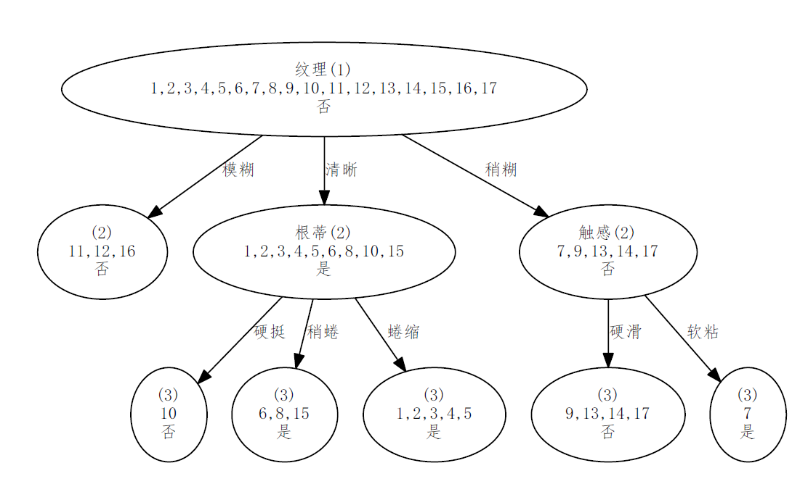
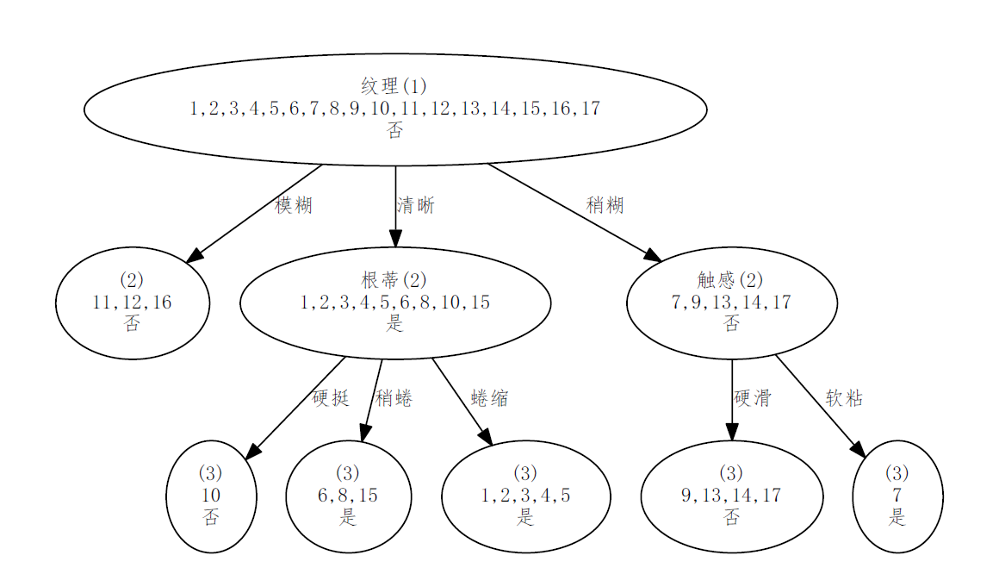

# Decision-Tree
(Machine Learning) Decision Tree


# 1. 决策树分类模型

参考资料：

《机器学习》第4章 决策树


# 1.1. ID3

ID3基于最大**信息增益**（Information Gain）选择分裂属性

- **信息熵**（Information Entropy）：《机器学习》P75 公式4.1

信息熵越小，样本纯度越高（样本越一致）。

样本只有一种元素时（所有元素相同），信息熵为0

```InformationEntropy(y)```函数实现


- **信息增益**：《机器学习》P75 公式4.2

```GainRatio(feature, target)```函数实现


# 1.2. C4.5

C4.5基于最大增益率（Gain Ratio）选择分裂属性。

**增益率**对可取值数目较少的属性有所偏好，因此，C4.5算法并不是直接选择增益率最大的候选划分属性，而是选择了一个启发式：先从候选划分属性中找出**信息增益**高于平均水平的属性，再从中选择**增益率**最高的。（《机器学习》P78-79）

- 属性的**固有值**（Intrinsic Value）：《机器学习》P78 公式4.4。本质上与计算样本的**信息熵**过程一样。

同样由```InformationEntropy(y)```函数实现

- **增益率**：《机器学习》P75 公式4.3

```GainRatio(feature, target)```函数实现

当分子为0（IV=0）时，表示该属性只有1个取值，此时增益率为0。

# 1.3. 算法逻辑


# 1.4. 程序实现


# 1.5. 结果

## 1.5.1 预测结果

## 1.5.2 决策树模型绘制

每一节点：划分属性名称、当前节点深度、样本编号、预测值（样本标签最多的值）

- ID3 
 


- C4.5 




# 3. 总结

模型  |  离散特征   | 连续特征   | 分裂数量                                | 分类问题 | 回归问题 
--    |--          |--         |--                                       |--       |--       
ID3   |信息增益     |无         |当前分裂属性值的数量                       |能       |不能        
C4.5  |启发式增益率 |二分法      |离散属性：属性值的数量</br> 连续属性：二分  |能       |不能    
CART  | |      |  |       |    


